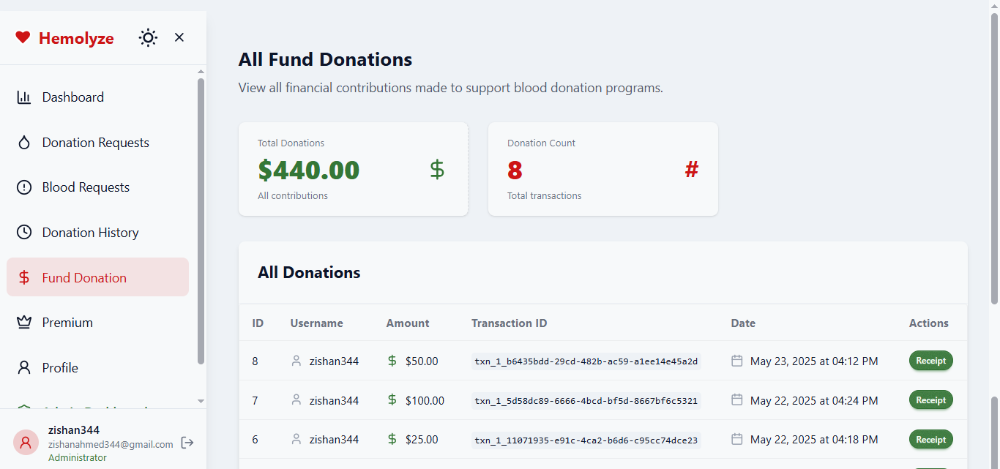

# Hemolyze - Blood Donation Management Platform

!Hemolyze

## Overview

Hemolyze is a comprehensive blood donation management platform that connects blood donors with recipients in need. The platform facilitates the entire blood donation process from request creation to donation completion, helping save lives through efficient blood supply management.

## Features

### For Blood Recipients

- **Blood Request System**: Create, update, and manage blood donation requests
- **Real-time Status Tracking**: Monitor the progress of blood donation requests
- **Donor Matching**: Get connected with compatible donors based on blood type
- **Hospital Integration**: Specify hospital details for donation coordination

### For Blood Donors

- **Available Requests**: Browse pending blood donation requests
- **Donor Profile**: Manage your donor profile with blood type, availability status
- **Donation History**: Track your past donations with certificates
- **Scheduled Donations**: Manage upcoming donation appointments

### General Features

- **User Dashboard**: Personalized dashboard showing relevant statistics and activities
- **Financial Contributions**: Option to donate funds to support blood donation programs
- **Responsive Design**: Seamless experience across desktop and mobile devices
- **Dark/Light Mode**: User preference-based theme switching

## Technology Stack

- **Frontend**: React with TypeScript, built with Vite
- **UI Framework**: Tailwind CSS with DaisyUI for component styling
- **State Management**: React Context API
- **Form Handling**: React Hook Form
- **API Integration**: Axios for HTTP requests
- **Authentication**: JWT-based authentication system
- **Notifications**: Toast notifications with react-hot-toast
- **Backend**: Django with Django REST Framework
- **Database**: PostgreSQL
- **API Documentation**: Swagger/OpenAPI integration

## Screenshots

Here are some screenshots of the Hemolyze platform:





## Key Components

- **Blood Request System**: Complete workflow for creating, accepting, and fulfilling blood requests
- **User Profile Management**: Comprehensive profile management with medical details
- **Admin Dashboard**: Administrative tools for monitoring and managing platform activities
- **Payment Integration**: Secure payment processing for financial contributions

## Future Enhancements

- Location-based donor matching
- Mobile app integration
- Real-time notifications
- Gamification elements to encourage regular donations
- Integration with healthcare institution systems

## Installation and Setup

```bash
# Clone the repository
git clone https://github.com/yourusername/hemolyze.git

# Navigate to the project directory
cd hemolyze

# Frontend Setup
pnpm install
pnpm run dev

# Backend Setup
cd backend
python -m venv venv
source venv/bin/activate  # On Windows use: venv\Scripts\activate
pip install -r requirements.txt
python manage.py migrate
python manage.py runserver

# Build for production
pnpm run build
```

## Contributing

Contributions are welcome! Please feel free to submit a Pull Request.

## License

This project is licensed under the MIT License.

---

Hemolyze - Because every drop counts.
